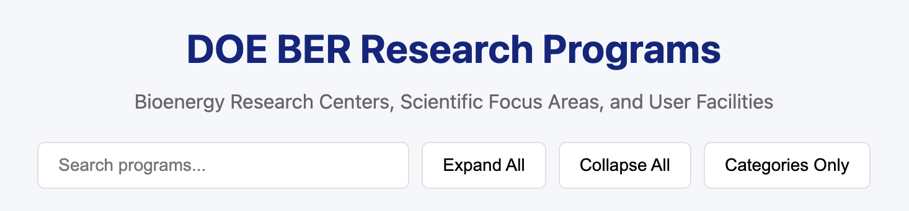
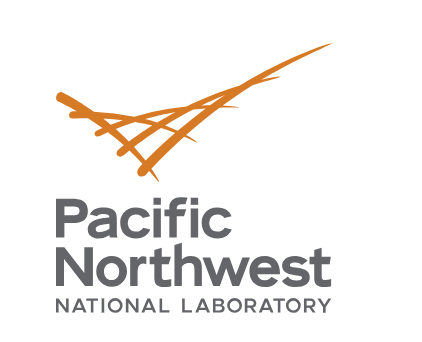
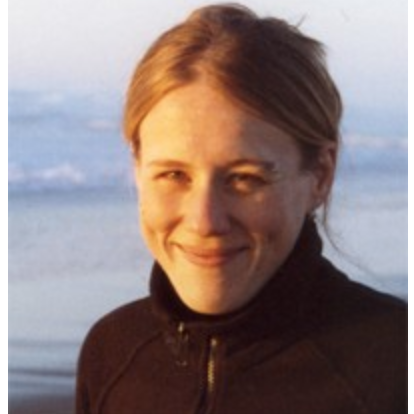

# BRIDGE: A Scientific Data Ecosystem

Open data, software, and schemas for the U.S. Department of Energy's
Biological and Environmental Research (BER) community.

[Data Lakehouse :material-arrow-down:](#data-lakehouse){ .md-button .md-button--primary }
[Data Modeling :material-arrow-down:](#data-modeling){ .md-button }
[Collaboration :material-arrow-down:](#national-lab-collaboration){ .md-button }
[Team :material-arrow-down:](#team){ .md-button }

<section class="section section--welcome" markdown>

## Welcome :wave:

Biological sciences are entering a new era — one shaped by data and powered by
strategic national resources like BER. These resources do more than store
scientific information; they enable discovery by collecting, transforming, and
organizing vast volumes of data. A single experimental file may be accompanied
by hundreds of thousands to millions of pieces of metadata — contextual details
essential for future use. To fully realize the benefits of Artificial
Intelligence (AI) in this space, we must go beyond simply accumulating data.
We need purposeful, high-quality data — curated and annotated at the time of
collection but structured to support future insight and innovation. This
requires smart, flexible data systems capable of linking diverse data types
across multiple institutions.

Investing in this curated data infrastructure is not just a technical choice,
it is a strategic imperative — one that lays the groundwork for predictive
science, accelerates discovery, and ensures the U.S. remains at the forefront
of scientific innovation.

For more information about the research programs and data centers supported
by DOE, click below.  It is likely that this list is currently incomplete, 
to add a resource or otherwise edit this list, please contact `smoxon @ lbl.gov` - feedback welcome!

-   

</section>

<section class="section section--infrastructure" markdown>

## Data Lakehouse

The data lakehouse architecture pattern was first described in 2021
([source PDF](https://people.eecs.berkeley.edu/~matei/papers/2021/cidr_lakehouse.pdf)).

!!! note
    System in development: architecture is subject to change.

Solving today's grand scientific challenges requires more than biology — it
demands interdisciplinary innovation in computation and data science. Yet,
many of our existing resources are designed with biological research in mind,
not computational discovery. While datasets may share high-level descriptors
like PI, project, or resource, and feature rich annotations from tools like
GO, ChEBI, or KEGG, the connective tissue — samples, analyses, metadata —
differs dramatically across platforms.

At JGI, for example, data is organized by PI and proposal, streamlining access
for individual users but making it harder to search by organism or taxa. In
contrast, NMDC builds around physical samples, EMSL emphasizes instrumentation,
and ESS-DIVE focuses on project datasets. This fragmentation poses a major
roadblock to scientific discovery — especially for AI systems that thrive on
pattern recognition across diverse, structured datasets.

To unlock the full potential of our data, we must reimagine our architecture.
We need new data structures and algorithms capable of linking billions of data
points across modalities, disciplines, and institutions — making science not
just accessible, but truly interoperable and discoverable at scale.

-   

    [__J-BERDL__](https://lakehouse-poc.jgi.lbl.gov/)

-   

    [__K-BERDL__](https://hub.berdl.kbase.us/)

</section>

<section class="section section--modeling" markdown>

## Data Modeling

Creating connections across projects. Each BER resource collects, stores,
and aggregates vast amounts of scientific data, with potentially millions of
pieces of metadata describing the context of each experiment. Well-defined
formats and community standards (GO, ENVO, GOLD, ChEBI, MIxS, and others)
exist, but every resource has historically managed its metadata
independently with its own models and tools.

BRIDGE is assembling a Data Stewards committee with representatives from
each partner organization. The Data Stewards create and maintain LinkML
models for every data source registered in their respective lakehouses,
building on the foundation of existing schemas. Each lakehouse maintains a
data directory describing its holdings, and BRIDGE operates a central
registry that indexes across lakehouses so scientists can discover what
data exists and where it resides.

-   

    [__Schemas__](schemas.md)

-   

    [__Registry__](https://github.com/ber-data)

</section>

<section class="section section--bertron" markdown>

## National Lab Collaboration

-   

    [__LBNL__](https://www.lbl.gov/)

-   

    [__PNNL__](https://www.pnnl.gov/)

-   

    [__ORNL__](https://www.ornl.gov/)

-   

    [__ANL__](https://www.anl.gov/)

This architecture pattern enables all participants to contribute their own
compute and storage infrastructure. Implementation of the same technology
stack and collaborative management of the data catalog allows for a logically
unified view of distributed assets.

Explore the variety of data available from EMSL, ESS-DIVE, JGI, KBase and NMDC
by accessing our code repos, or sites.

</section>

<section class="section section--contribs" markdown>

## Team

Representatives from these institutions have committed time to building the
global search resource and data lakehouse.

### Partners

-   

    [__JGI__](https://jgi.doe.gov/)

-   

    [__ESS-DIVE__](https://ess-dive.lbl.gov/)

-   

    [__NMDC__](https://microbiomedata.org/)

-   

    [__EMSL__](https://www.emsl.pnnl.gov/)

-   

    [__KBase__](https://www.kbase.us/)

### Staff

-   __Valerie Skye__

    JGI, BRIDGE

-   

    __Kjiersten Fagnan__

    JGI

-   __Danielle Christianson__

    ESS-DIVE, BRIDGE

-   

    __Shreyas Cholia__

    ESS-DIVE, NMDC

-   

    __Alicia Clum__

    NMDC

-   

    __Sierra Moxon__

    NMDC, BRIDGE

-   

    __Makena Dettmann__

    EMSL

-   

    __James Carr__

    EMSL

-   

    __Montana Smith__

    EMSL, NMDC, BRIDGE

-   __Conrad Mearns__

    EMSL, BRIDGE

-   

    __Ryan Ly__

    JAMO, BRIDGE

-   

    __AJ Ireland__

    KBase, BRIDGE

-   

    __Gazi Mahmud__

    KBase

-   

    __Elisha Wood-Charlson__

    KBase

-   __Georg Rath__

    JGI, BRIDGE

-   __Deanna Beatty__

    JGI, BRIDGE

!!! note "Join us"
    Contributors are welcome. Open an issue or PR on any of our
    [repositories](https://github.com/ber-data).

</section>

<section class="section section--funding" markdown>

  Supported by
  

</section>
